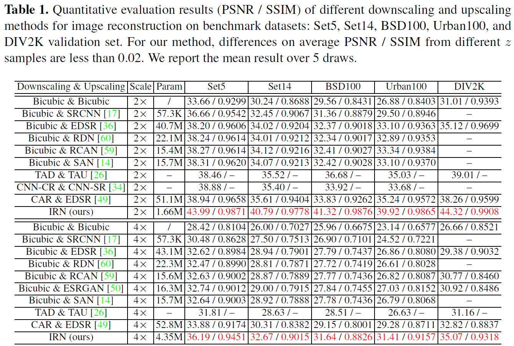

# Invertible Image Rescaling
This is the PyTorch implementation of paper: Invertible Image Rescaling (ECCV 2020 Oral). [arxiv](https://arxiv.org/abs/2005.05650).

## Dependencies and Installation
- Python 3 (Recommend to use [Anaconda](https://www.anaconda.com/download/#linux))
- [PyTorch >= 1.0](https://pytorch.org/)
- NVIDIA GPU + [CUDA](https://developer.nvidia.com/cuda-downloads)
- Python packages: `pip install numpy opencv-python lmdb pyyaml`
- TensorBoard: 
  - PyTorch >= 1.1: `pip install tb-nightly future`
  - PyTorch == 1.0: `pip install tensorboardX`
  
## Dataset Preparation
Commonly used training and testing datasets can be downloaded [here](https://github.com/xinntao/BasicSR/wiki/Prepare-datasets-in-LMDB-format).

## Get Started
Training and testing codes are in ['codes/'](./codes/). Please see ['codes/README.md'](./codes/README.md) for basic usages.

## Invertible Architecture

## Quantitative Results

## Quanlitative Results

## Acknowledgement
The code is based on [BasicSR](https://github.com/xinntao/BasicSR), with reference of [FrEIA](https://github.com/VLL-HD/FrEIA).

## Contact
If you have any questions, please contact <mingqing_xiao@pku.edu.cn>.
